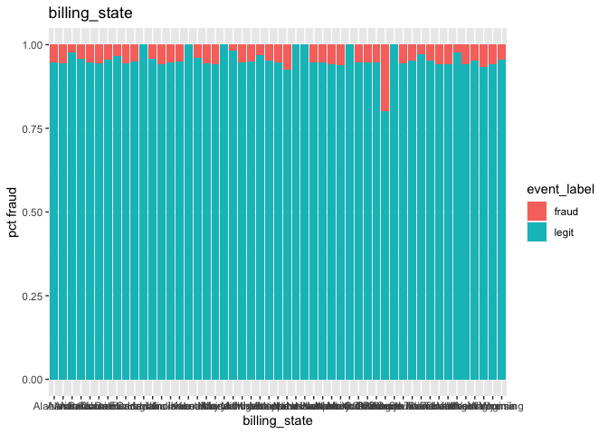
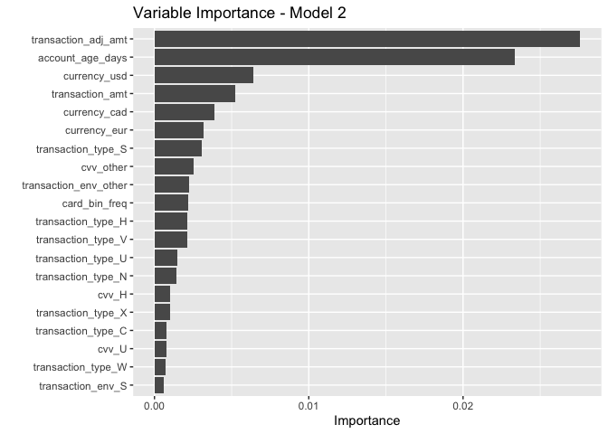

Fraud Detection
================
Nicole An
2022-11-01

## Load Libraries

``` r
library(tidyverse)
library(tidymodels)
library(janitor)
library(skimr)
library(kableExtra) # -- make nice looking resutls when we knitt 
library(vip)        # --  tidymodels variable importance
library(fastshap)   # -- shapley values for variable importance 
library(MASS)
library(rpart.plot) # -- plotting decision trees 
library(ranger)     # -- ranger engine for random forest
options(yardstick.event_first = TRUE)
```

## Load Data

Import your data with read_csv()

``` r
fraud <- read_csv("project_2_training.csv") %>%
  clean_names()
```

    ## Rows: 125000 Columns: 27
    ## ── Column specification ────────────────────────────────────────────────────────
    ## Delimiter: ","
    ## chr  (17): ip_address, user_agent, email_domain, phone_number, billing_city,...
    ## dbl   (9): EVENT_ID, account_age_days, transaction_amt, transaction_adj_amt,...
    ## dttm  (1): EVENT_TIMESTAMP
    ## 
    ## ℹ Use `spec()` to retrieve the full column specification for this data.
    ## ℹ Specify the column types or set `show_col_types = FALSE` to quiet this message.

``` r
head(fraud) 
```

    ## # A tibble: 6 × 27
    ##   event_id account_age…¹ trans…² trans…³ histo…⁴ ip_ad…⁵ user_…⁶ email…⁷ phone…⁸
    ##      <dbl>         <dbl>   <dbl>   <dbl>   <dbl> <chr>   <chr>   <chr>   <chr>  
    ## 1  2608000          5774    2172      78    4523 81.237… Mozill… graves… 456-91…
    ## 2   214500          5405    2887      51    4057 160.32… Mozill… howard… 269.36…
    ## 3   294600          6570    2887      56    5602 109.15… Mozill… walsh-… 366.18…
    ## 4   477060          3865    1591      58    3926 158.15… Mozill… gonzal… 816-36…
    ## 5  1993100          6625    3297      70    6675 167.16… Mozill… bender… 001-97…
    ## 6  1810560          5513    2946      56    6196 199.82… Opera/… west.i… (240)5…
    ## # … with 18 more variables: billing_city <chr>, billing_postal <dbl>,
    ## #   billing_state <chr>, card_bin <dbl>, currency <chr>, cvv <chr>,
    ## #   signature_image <chr>, transaction_type <chr>, transaction_env <chr>,
    ## #   event_timestamp <dttm>, applicant_name <chr>, billing_address <chr>,
    ## #   merchant_id <chr>, locale <chr>, tranaction_initiate <chr>,
    ## #   days_since_last_logon <dbl>, inital_amount <dbl>, event_label <chr>, and
    ## #   abbreviated variable names ¹​account_age_days, ²​transaction_amt, …

``` r
fraud_kaggle <- read_csv("project_2_holdout.csv") %>%
  clean_names()
```

    ## Rows: 25000 Columns: 27
    ## ── Column specification ────────────────────────────────────────────────────────
    ## Delimiter: ","
    ## chr  (16): ip_address, user_agent, email_domain, phone_number, billing_city,...
    ## dbl  (10): EVENT_ID, account_age_days, transaction_amt, transaction_adj_amt,...
    ## dttm  (1): EVENT_TIMESTAMP
    ## 
    ## ℹ Use `spec()` to retrieve the full column specification for this data.
    ## ℹ Specify the column types or set `show_col_types = FALSE` to quiet this message.

## Explore target

What percentage of patients were no-shows for their appointments

``` r
# convert numberic binary columns to factors

fraud$event_label <- as.factor(fraud$event_label)
head(fraud)
```

    ## # A tibble: 6 × 27
    ##   event_id account_age…¹ trans…² trans…³ histo…⁴ ip_ad…⁵ user_…⁶ email…⁷ phone…⁸
    ##      <dbl>         <dbl>   <dbl>   <dbl>   <dbl> <chr>   <chr>   <chr>   <chr>  
    ## 1  2608000          5774    2172      78    4523 81.237… Mozill… graves… 456-91…
    ## 2   214500          5405    2887      51    4057 160.32… Mozill… howard… 269.36…
    ## 3   294600          6570    2887      56    5602 109.15… Mozill… walsh-… 366.18…
    ## 4   477060          3865    1591      58    3926 158.15… Mozill… gonzal… 816-36…
    ## 5  1993100          6625    3297      70    6675 167.16… Mozill… bender… 001-97…
    ## 6  1810560          5513    2946      56    6196 199.82… Opera/… west.i… (240)5…
    ## # … with 18 more variables: billing_city <chr>, billing_postal <dbl>,
    ## #   billing_state <chr>, card_bin <dbl>, currency <chr>, cvv <chr>,
    ## #   signature_image <chr>, transaction_type <chr>, transaction_env <chr>,
    ## #   event_timestamp <dttm>, applicant_name <chr>, billing_address <chr>,
    ## #   merchant_id <chr>, locale <chr>, tranaction_initiate <chr>,
    ## #   days_since_last_logon <dbl>, inital_amount <dbl>, event_label <fct>, and
    ## #   abbreviated variable names ¹​account_age_days, ²​transaction_amt, …

``` r
fraud_target <- fraud %>% 
  count(event_label) %>%
  mutate(pct = n/sum(n))


fraud_target %>%
  ggplot(aes(x=event_label,y=pct)) +
  geom_col()  + 
  geom_text(aes(label = paste(round(pct*100,1),"%")), vjust = 1.2, colour = "white") +
  labs(title="How many transactions were fraud?", x="Event Label", y="PCT")
```

<!-- -->

``` r
fraud %>%
  group_by(event_label) %>%
  summarize(n=n()) %>%
  ungroup() %>%
  mutate(pct = n/sum(n))
```

    ## # A tibble: 2 × 3
    ##   event_label      n    pct
    ##   <fct>        <int>  <dbl>
    ## 1 fraud         6785 0.0543
    ## 2 legit       118215 0.946

## Explore predictor data

``` r
fraud %>% skim_to_wide()
```

<table style="width: auto;" class="table table-condensed">
<caption>
Data summary
</caption>
<tbody>
<tr>
<td style="text-align:left;">
Name
</td>
<td style="text-align:left;">
Piped data
</td>
</tr>
<tr>
<td style="text-align:left;">
Number of rows
</td>
<td style="text-align:left;">
125000
</td>
</tr>
<tr>
<td style="text-align:left;">
Number of columns
</td>
<td style="text-align:left;">
27
</td>
</tr>
<tr>
<td style="text-align:left;">
\_\_\_\_\_\_\_\_\_\_\_\_\_\_\_\_\_\_\_\_\_\_\_
</td>
<td style="text-align:left;">
</td>
</tr>
<tr>
<td style="text-align:left;">
Column type frequency:
</td>
<td style="text-align:left;">
</td>
</tr>
<tr>
<td style="text-align:left;">
character
</td>
<td style="text-align:left;">
16
</td>
</tr>
<tr>
<td style="text-align:left;">
factor
</td>
<td style="text-align:left;">
1
</td>
</tr>
<tr>
<td style="text-align:left;">
numeric
</td>
<td style="text-align:left;">
9
</td>
</tr>
<tr>
<td style="text-align:left;">
POSIXct
</td>
<td style="text-align:left;">
1
</td>
</tr>
<tr>
<td style="text-align:left;">
\_\_\_\_\_\_\_\_\_\_\_\_\_\_\_\_\_\_\_\_\_\_\_\_
</td>
<td style="text-align:left;">
</td>
</tr>
<tr>
<td style="text-align:left;">
Group variables
</td>
<td style="text-align:left;">
None
</td>
</tr>
</tbody>
</table>

**Variable type: character**

<table>
<thead>
<tr>
<th style="text-align:left;">
skim_variable
</th>
<th style="text-align:right;">
n_missing
</th>
<th style="text-align:right;">
complete_rate
</th>
<th style="text-align:right;">
min
</th>
<th style="text-align:right;">
max
</th>
<th style="text-align:right;">
empty
</th>
<th style="text-align:right;">
n_unique
</th>
<th style="text-align:right;">
whitespace
</th>
</tr>
</thead>
<tbody>
<tr>
<td style="text-align:left;">
ip_address
</td>
<td style="text-align:right;">
0
</td>
<td style="text-align:right;">
1
</td>
<td style="text-align:right;">
3
</td>
<td style="text-align:right;">
15
</td>
<td style="text-align:right;">
0
</td>
<td style="text-align:right;">
13314
</td>
<td style="text-align:right;">
0
</td>
</tr>
<tr>
<td style="text-align:left;">
user_agent
</td>
<td style="text-align:right;">
0
</td>
<td style="text-align:right;">
1
</td>
<td style="text-align:right;">
3
</td>
<td style="text-align:right;">
147
</td>
<td style="text-align:right;">
0
</td>
<td style="text-align:right;">
8571
</td>
<td style="text-align:right;">
0
</td>
</tr>
<tr>
<td style="text-align:left;">
email_domain
</td>
<td style="text-align:right;">
0
</td>
<td style="text-align:right;">
1
</td>
<td style="text-align:right;">
3
</td>
<td style="text-align:right;">
25
</td>
<td style="text-align:right;">
0
</td>
<td style="text-align:right;">
6992
</td>
<td style="text-align:right;">
0
</td>
</tr>
<tr>
<td style="text-align:left;">
phone_number
</td>
<td style="text-align:right;">
0
</td>
<td style="text-align:right;">
1
</td>
<td style="text-align:right;">
3
</td>
<td style="text-align:right;">
22
</td>
<td style="text-align:right;">
0
</td>
<td style="text-align:right;">
11928
</td>
<td style="text-align:right;">
0
</td>
</tr>
<tr>
<td style="text-align:left;">
billing_city
</td>
<td style="text-align:right;">
0
</td>
<td style="text-align:right;">
1
</td>
<td style="text-align:right;">
3
</td>
<td style="text-align:right;">
24
</td>
<td style="text-align:right;">
0
</td>
<td style="text-align:right;">
8980
</td>
<td style="text-align:right;">
0
</td>
</tr>
<tr>
<td style="text-align:left;">
billing_state
</td>
<td style="text-align:right;">
0
</td>
<td style="text-align:right;">
1
</td>
<td style="text-align:right;">
3
</td>
<td style="text-align:right;">
14
</td>
<td style="text-align:right;">
0
</td>
<td style="text-align:right;">
51
</td>
<td style="text-align:right;">
0
</td>
</tr>
<tr>
<td style="text-align:left;">
currency
</td>
<td style="text-align:right;">
0
</td>
<td style="text-align:right;">
1
</td>
<td style="text-align:right;">
3
</td>
<td style="text-align:right;">
3
</td>
<td style="text-align:right;">
0
</td>
<td style="text-align:right;">
4
</td>
<td style="text-align:right;">
0
</td>
</tr>
<tr>
<td style="text-align:left;">
cvv
</td>
<td style="text-align:right;">
0
</td>
<td style="text-align:right;">
1
</td>
<td style="text-align:right;">
1
</td>
<td style="text-align:right;">
3
</td>
<td style="text-align:right;">
0
</td>
<td style="text-align:right;">
26
</td>
<td style="text-align:right;">
0
</td>
</tr>
<tr>
<td style="text-align:left;">
signature_image
</td>
<td style="text-align:right;">
0
</td>
<td style="text-align:right;">
1
</td>
<td style="text-align:right;">
1
</td>
<td style="text-align:right;">
3
</td>
<td style="text-align:right;">
0
</td>
<td style="text-align:right;">
27
</td>
<td style="text-align:right;">
0
</td>
</tr>
<tr>
<td style="text-align:left;">
transaction_type
</td>
<td style="text-align:right;">
0
</td>
<td style="text-align:right;">
1
</td>
<td style="text-align:right;">
1
</td>
<td style="text-align:right;">
3
</td>
<td style="text-align:right;">
0
</td>
<td style="text-align:right;">
27
</td>
<td style="text-align:right;">
0
</td>
</tr>
<tr>
<td style="text-align:left;">
transaction_env
</td>
<td style="text-align:right;">
0
</td>
<td style="text-align:right;">
1
</td>
<td style="text-align:right;">
1
</td>
<td style="text-align:right;">
3
</td>
<td style="text-align:right;">
0
</td>
<td style="text-align:right;">
27
</td>
<td style="text-align:right;">
0
</td>
</tr>
<tr>
<td style="text-align:left;">
applicant_name
</td>
<td style="text-align:right;">
124
</td>
<td style="text-align:right;">
1
</td>
<td style="text-align:right;">
6
</td>
<td style="text-align:right;">
27
</td>
<td style="text-align:right;">
0
</td>
<td style="text-align:right;">
84958
</td>
<td style="text-align:right;">
0
</td>
</tr>
<tr>
<td style="text-align:left;">
billing_address
</td>
<td style="text-align:right;">
111
</td>
<td style="text-align:right;">
1
</td>
<td style="text-align:right;">
11
</td>
<td style="text-align:right;">
38
</td>
<td style="text-align:right;">
0
</td>
<td style="text-align:right;">
124884
</td>
<td style="text-align:right;">
0
</td>
</tr>
<tr>
<td style="text-align:left;">
merchant_id
</td>
<td style="text-align:right;">
89
</td>
<td style="text-align:right;">
1
</td>
<td style="text-align:right;">
11
</td>
<td style="text-align:right;">
11
</td>
<td style="text-align:right;">
0
</td>
<td style="text-align:right;">
124904
</td>
<td style="text-align:right;">
0
</td>
</tr>
<tr>
<td style="text-align:left;">
locale
</td>
<td style="text-align:right;">
115
</td>
<td style="text-align:right;">
1
</td>
<td style="text-align:right;">
5
</td>
<td style="text-align:right;">
6
</td>
<td style="text-align:right;">
0
</td>
<td style="text-align:right;">
293
</td>
<td style="text-align:right;">
0
</td>
</tr>
<tr>
<td style="text-align:left;">
tranaction_initiate
</td>
<td style="text-align:right;">
100
</td>
<td style="text-align:right;">
1
</td>
<td style="text-align:right;">
1
</td>
<td style="text-align:right;">
1
</td>
<td style="text-align:right;">
0
</td>
<td style="text-align:right;">
26
</td>
<td style="text-align:right;">
0
</td>
</tr>
</tbody>
</table>

**Variable type: factor**

<table>
<thead>
<tr>
<th style="text-align:left;">
skim_variable
</th>
<th style="text-align:right;">
n_missing
</th>
<th style="text-align:right;">
complete_rate
</th>
<th style="text-align:left;">
ordered
</th>
<th style="text-align:right;">
n_unique
</th>
<th style="text-align:left;">
top_counts
</th>
</tr>
</thead>
<tbody>
<tr>
<td style="text-align:left;">
event_label
</td>
<td style="text-align:right;">
0
</td>
<td style="text-align:right;">
1
</td>
<td style="text-align:left;">
FALSE
</td>
<td style="text-align:right;">
2
</td>
<td style="text-align:left;">
leg: 118215, fra: 6785
</td>
</tr>
</tbody>
</table>

**Variable type: numeric**

<table>
<thead>
<tr>
<th style="text-align:left;">
skim_variable
</th>
<th style="text-align:right;">
n_missing
</th>
<th style="text-align:right;">
complete_rate
</th>
<th style="text-align:right;">
mean
</th>
<th style="text-align:right;">
sd
</th>
<th style="text-align:right;">
p0
</th>
<th style="text-align:right;">
p25
</th>
<th style="text-align:right;">
p50
</th>
<th style="text-align:right;">
p75
</th>
<th style="text-align:right;">
p100
</th>
<th style="text-align:left;">
hist
</th>
</tr>
</thead>
<tbody>
<tr>
<td style="text-align:left;">
event_id
</td>
<td style="text-align:right;">
0
</td>
<td style="text-align:right;">
1
</td>
<td style="text-align:right;">
1500443.74
</td>
<td style="text-align:right;">
866356.54
</td>
<td style="text-align:right;">
20
</td>
<td style="text-align:right;">
750535
</td>
<td style="text-align:right;">
1500570
</td>
<td style="text-align:right;">
2251825.00
</td>
<td style="text-align:right;">
2999960
</td>
<td style="text-align:left;">
▇▇▇▇▇
</td>
</tr>
<tr>
<td style="text-align:left;">
account_age_days
</td>
<td style="text-align:right;">
0
</td>
<td style="text-align:right;">
1
</td>
<td style="text-align:right;">
4642.45
</td>
<td style="text-align:right;">
1160.92
</td>
<td style="text-align:right;">
-1
</td>
<td style="text-align:right;">
3822
</td>
<td style="text-align:right;">
4668
</td>
<td style="text-align:right;">
5472.00
</td>
<td style="text-align:right;">
9119
</td>
<td style="text-align:left;">
▁▃▇▃▁
</td>
</tr>
<tr>
<td style="text-align:left;">
transaction_amt
</td>
<td style="text-align:right;">
0
</td>
<td style="text-align:right;">
1
</td>
<td style="text-align:right;">
2519.55
</td>
<td style="text-align:right;">
609.30
</td>
<td style="text-align:right;">
-1
</td>
<td style="text-align:right;">
2102
</td>
<td style="text-align:right;">
2543
</td>
<td style="text-align:right;">
2952.00
</td>
<td style="text-align:right;">
4880
</td>
<td style="text-align:left;">
▁▂▇▃▁
</td>
</tr>
<tr>
<td style="text-align:left;">
transaction_adj_amt
</td>
<td style="text-align:right;">
0
</td>
<td style="text-align:right;">
1
</td>
<td style="text-align:right;">
54.14
</td>
<td style="text-align:right;">
10.17
</td>
<td style="text-align:right;">
-1
</td>
<td style="text-align:right;">
48
</td>
<td style="text-align:right;">
55
</td>
<td style="text-align:right;">
61.00
</td>
<td style="text-align:right;">
99
</td>
<td style="text-align:left;">
▁▁▇▃▁
</td>
</tr>
<tr>
<td style="text-align:left;">
historic_velocity
</td>
<td style="text-align:right;">
0
</td>
<td style="text-align:right;">
1
</td>
<td style="text-align:right;">
4699.90
</td>
<td style="text-align:right;">
1194.36
</td>
<td style="text-align:right;">
-1
</td>
<td style="text-align:right;">
3871
</td>
<td style="text-align:right;">
4731
</td>
<td style="text-align:right;">
5549.00
</td>
<td style="text-align:right;">
8875
</td>
<td style="text-align:left;">
▁▂▇▅▁
</td>
</tr>
<tr>
<td style="text-align:left;">
billing_postal
</td>
<td style="text-align:right;">
98
</td>
<td style="text-align:right;">
1
</td>
<td style="text-align:right;">
50210.79
</td>
<td style="text-align:right;">
28405.88
</td>
<td style="text-align:right;">
503
</td>
<td style="text-align:right;">
25298
</td>
<td style="text-align:right;">
50124
</td>
<td style="text-align:right;">
74457.00
</td>
<td style="text-align:right;">
99950
</td>
<td style="text-align:left;">
▇▇▇▇▇
</td>
</tr>
<tr>
<td style="text-align:left;">
card_bin
</td>
<td style="text-align:right;">
110
</td>
<td style="text-align:right;">
1
</td>
<td style="text-align:right;">
41813.29
</td>
<td style="text-align:right;">
10084.07
</td>
<td style="text-align:right;">
6040
</td>
<td style="text-align:right;">
35378
</td>
<td style="text-align:right;">
42061
</td>
<td style="text-align:right;">
47330.75
</td>
<td style="text-align:right;">
67639
</td>
<td style="text-align:left;">
▁▃▇▇▂
</td>
</tr>
<tr>
<td style="text-align:left;">
days_since_last_logon
</td>
<td style="text-align:right;">
113
</td>
<td style="text-align:right;">
1
</td>
<td style="text-align:right;">
49.81
</td>
<td style="text-align:right;">
29.22
</td>
<td style="text-align:right;">
0
</td>
<td style="text-align:right;">
24
</td>
<td style="text-align:right;">
50
</td>
<td style="text-align:right;">
75.00
</td>
<td style="text-align:right;">
100
</td>
<td style="text-align:left;">
▇▇▇▇▇
</td>
</tr>
<tr>
<td style="text-align:left;">
inital_amount
</td>
<td style="text-align:right;">
109
</td>
<td style="text-align:right;">
1
</td>
<td style="text-align:right;">
7999.64
</td>
<td style="text-align:right;">
4050.18
</td>
<td style="text-align:right;">
1000
</td>
<td style="text-align:right;">
4486
</td>
<td style="text-align:right;">
8007
</td>
<td style="text-align:right;">
11498.00
</td>
<td style="text-align:right;">
15000
</td>
<td style="text-align:left;">
▇▇▇▇▇
</td>
</tr>
</tbody>
</table>

**Variable type: POSIXct**

<table>
<thead>
<tr>
<th style="text-align:left;">
skim_variable
</th>
<th style="text-align:right;">
n_missing
</th>
<th style="text-align:right;">
complete_rate
</th>
<th style="text-align:left;">
min
</th>
<th style="text-align:left;">
max
</th>
<th style="text-align:left;">
median
</th>
<th style="text-align:right;">
n_unique
</th>
</tr>
</thead>
<tbody>
<tr>
<td style="text-align:left;">
event_timestamp
</td>
<td style="text-align:right;">
90
</td>
<td style="text-align:right;">
1
</td>
<td style="text-align:left;">
2020-10-25 08:44:38
</td>
<td style="text-align:left;">
2021-10-25 14:27:09
</td>
<td style="text-align:left;">
2021-04-25 23:50:23
</td>
<td style="text-align:right;">
124685
</td>
</tr>
</tbody>
</table>

## Exlpore using bar graphs & boxplots

``` r
fraud_vis <- fraud %>% 
  mutate(user_agent_browser = sub("/.*","",user_agent))%>%
   mutate_if(is.character, factor) %>%
  mutate(card_bin = as.factor(card_bin))

for (c in names(fraud_vis %>% dplyr::select(!c(event_id,ip_address,user_agent,email_domain,phone_number,billing_city,applicant_name,billing_address,merchant_id,locale,event_label)))) {
  if (c == "event_timestamp") {
    print( fraud_vis %>%
             ggplot(., aes(!!as.name(c))) + 
             geom_histogram(aes(bins=10,fill = event_label), position = "fill")  +labs(title = c, y = "pct fraud"))
      
  }else if (c %in% names(fraud_vis %>% dplyr::select(where(is.factor)))) {
    # -- for each character column create a chart
    print( fraud_vis %>%
             ggplot(., aes(!!as.name(c))) + 
             geom_bar(aes(fill = event_label), position = "fill")  + labs(title = c, y = "pct fraud"))
  } else {
    # -- comparative boxplots
    print(ggplot(fraud_vis, aes(x=event_label, y=!!as.name(c), fill=event_label))+ geom_boxplot() +labs(title = c))
  }
}
```

<!-- --><!-- --><!-- --><!-- --><!-- --><!-- --><!-- --><!-- --><!-- --><!-- --><!-- --><!-- --><!-- --><!-- --><!-- --><!-- --><!-- -->

### Does email domain influence fraud?

``` r
fraud_vis %>% 
  count(event_label, email_domain) %>%
  pivot_wider(id_cols = email_domain, names_from = event_label, values_from=n, 
              values_fill=0) %>%
  mutate(tot = `legit` + `fraud`,
         pct = `fraud`/tot)  %>% 
  arrange(desc(pct)) %>%
  ggplot(., aes(pct)) + 
             geom_histogram(aes(bins=50)) +
  geom_vline(xintercept=0.054,color="red",linetype = "longdash") +
  labs(title = "Does email domain influence fraud?", x = "pct fraud", y = "count levles")
```

<!-- -->

### Does billing postal influence fraud?

``` r
fraud_vis %>% 
  count(event_label, billing_postal) %>%
  pivot_wider(id_cols = billing_postal, names_from = event_label, values_from=n, 
              values_fill=0) %>%
  mutate(tot = `legit` + `fraud`,
         pct = `fraud`/tot)  %>% 
  arrange(desc(pct)) %>%
  ggplot(., aes(pct)) + 
             geom_histogram(aes(bins=50)) +
  geom_vline(xintercept=0.054,color="red",linetype = "longdash") +
  labs(title = "Does billing postal influence fraud?", x = "pct fraud", y = "count levels")
```

<!-- -->

### Does browser type influence fraud?

``` r
fraud_vis %>% 
  count(event_label, user_agent_browser) %>%
  pivot_wider(id_cols = user_agent_browser, names_from = event_label, values_from=n, 
              values_fill=0) %>%
  mutate(tot = `legit` + `fraud`,
         pct = `fraud`/tot)
```

    ## # A tibble: 3 × 5
    ##   user_agent_browser fraud legit   tot    pct
    ##   <fct>              <int> <int> <int>  <dbl>
    ## 1 Mozilla             5208 89633 94841 0.0549
    ## 2 nan                    7    88    95 0.0737
    ## 3 Opera               1570 28494 30064 0.0522

## Partition your data

### Convert character variables to factors (binary numerics were converted above)

``` r
fraud %>%
  #mutate(user_agent_browser = sub("/.*","",user_agent))%>%
  mutate_if(is.character, factor) %>%
  mutate(card_bin = as.factor(card_bin)) %>%
  mutate(billing_postal = as.factor(billing_postal)) -> fraud_prep

fraud_prep %>% skim_to_wide()
```

<table style="width: auto;" class="table table-condensed">
<caption>
Data summary
</caption>
<tbody>
<tr>
<td style="text-align:left;">
Name
</td>
<td style="text-align:left;">
Piped data
</td>
</tr>
<tr>
<td style="text-align:left;">
Number of rows
</td>
<td style="text-align:left;">
125000
</td>
</tr>
<tr>
<td style="text-align:left;">
Number of columns
</td>
<td style="text-align:left;">
27
</td>
</tr>
<tr>
<td style="text-align:left;">
\_\_\_\_\_\_\_\_\_\_\_\_\_\_\_\_\_\_\_\_\_\_\_
</td>
<td style="text-align:left;">
</td>
</tr>
<tr>
<td style="text-align:left;">
Column type frequency:
</td>
<td style="text-align:left;">
</td>
</tr>
<tr>
<td style="text-align:left;">
factor
</td>
<td style="text-align:left;">
19
</td>
</tr>
<tr>
<td style="text-align:left;">
numeric
</td>
<td style="text-align:left;">
7
</td>
</tr>
<tr>
<td style="text-align:left;">
POSIXct
</td>
<td style="text-align:left;">
1
</td>
</tr>
<tr>
<td style="text-align:left;">
\_\_\_\_\_\_\_\_\_\_\_\_\_\_\_\_\_\_\_\_\_\_\_\_
</td>
<td style="text-align:left;">
</td>
</tr>
<tr>
<td style="text-align:left;">
Group variables
</td>
<td style="text-align:left;">
None
</td>
</tr>
</tbody>
</table>

**Variable type: factor**

<table>
<thead>
<tr>
<th style="text-align:left;">
skim_variable
</th>
<th style="text-align:right;">
n_missing
</th>
<th style="text-align:right;">
complete_rate
</th>
<th style="text-align:left;">
ordered
</th>
<th style="text-align:right;">
n_unique
</th>
<th style="text-align:left;">
top_counts
</th>
</tr>
</thead>
<tbody>
<tr>
<td style="text-align:left;">
ip_address
</td>
<td style="text-align:right;">
0
</td>
<td style="text-align:right;">
1
</td>
<td style="text-align:left;">
FALSE
</td>
<td style="text-align:right;">
13314
</td>
<td style="text-align:left;">
nan: 104, 112: 32, 221: 32, 114: 30
</td>
</tr>
<tr>
<td style="text-align:left;">
user_agent
</td>
<td style="text-align:right;">
0
</td>
<td style="text-align:right;">
1
</td>
<td style="text-align:left;">
FALSE
</td>
<td style="text-align:right;">
8571
</td>
<td style="text-align:left;">
nan: 95, Moz: 60, Moz: 57, Moz: 56
</td>
</tr>
<tr>
<td style="text-align:left;">
email_domain
</td>
<td style="text-align:right;">
0
</td>
<td style="text-align:right;">
1
</td>
<td style="text-align:left;">
FALSE
</td>
<td style="text-align:right;">
6992
</td>
<td style="text-align:left;">
nan: 76, fre: 61, cal: 59, sol: 59
</td>
</tr>
<tr>
<td style="text-align:left;">
phone_number
</td>
<td style="text-align:right;">
0
</td>
<td style="text-align:right;">
1
</td>
<td style="text-align:left;">
FALSE
</td>
<td style="text-align:right;">
11928
</td>
<td style="text-align:left;">
nan: 102, 292: 43, 349: 39, 414: 37
</td>
</tr>
<tr>
<td style="text-align:left;">
billing_city
</td>
<td style="text-align:right;">
0
</td>
<td style="text-align:right;">
1
</td>
<td style="text-align:left;">
FALSE
</td>
<td style="text-align:right;">
8980
</td>
<td style="text-align:left;">
nan: 94, Lak: 46, Ric: 46, Dav: 45
</td>
</tr>
<tr>
<td style="text-align:left;">
billing_postal
</td>
<td style="text-align:right;">
0
</td>
<td style="text-align:right;">
1
</td>
<td style="text-align:left;">
FALSE
</td>
<td style="text-align:right;">
11065
</td>
<td style="text-align:left;">
NaN: 98, 157: 38, 854: 38, 957: 38
</td>
</tr>
<tr>
<td style="text-align:left;">
billing_state
</td>
<td style="text-align:right;">
0
</td>
<td style="text-align:right;">
1
</td>
<td style="text-align:left;">
FALSE
</td>
<td style="text-align:right;">
51
</td>
<td style="text-align:left;">
Ind: 7354, Mic: 7277, Lou: 7229, Rho: 7162
</td>
</tr>
<tr>
<td style="text-align:left;">
card_bin
</td>
<td style="text-align:right;">
0
</td>
<td style="text-align:right;">
1
</td>
<td style="text-align:left;">
FALSE
</td>
<td style="text-align:right;">
6322
</td>
<td style="text-align:left;">
NaN: 110, 653: 73, 655: 73, 409: 71
</td>
</tr>
<tr>
<td style="text-align:left;">
currency
</td>
<td style="text-align:right;">
0
</td>
<td style="text-align:right;">
1
</td>
<td style="text-align:left;">
FALSE
</td>
<td style="text-align:right;">
4
</td>
<td style="text-align:left;">
cad: 94846, usd: 26414, eur: 3646, nan: 94
</td>
</tr>
<tr>
<td style="text-align:left;">
cvv
</td>
<td style="text-align:right;">
0
</td>
<td style="text-align:right;">
1
</td>
<td style="text-align:left;">
FALSE
</td>
<td style="text-align:right;">
26
</td>
<td style="text-align:left;">
D: 19323, W: 19194, G: 16937, X: 16331
</td>
</tr>
<tr>
<td style="text-align:left;">
signature_image
</td>
<td style="text-align:right;">
0
</td>
<td style="text-align:right;">
1
</td>
<td style="text-align:left;">
FALSE
</td>
<td style="text-align:right;">
27
</td>
<td style="text-align:left;">
H: 14412, F: 13988, U: 13564, I: 12714
</td>
</tr>
<tr>
<td style="text-align:left;">
transaction_type
</td>
<td style="text-align:right;">
0
</td>
<td style="text-align:right;">
1
</td>
<td style="text-align:left;">
FALSE
</td>
<td style="text-align:right;">
27
</td>
<td style="text-align:left;">
I: 13530, G: 13226, F: 12965, D: 12909
</td>
</tr>
<tr>
<td style="text-align:left;">
transaction_env
</td>
<td style="text-align:right;">
0
</td>
<td style="text-align:right;">
1
</td>
<td style="text-align:left;">
FALSE
</td>
<td style="text-align:right;">
27
</td>
<td style="text-align:left;">
D: 18876, W: 17826, G: 17258, X: 14297
</td>
</tr>
<tr>
<td style="text-align:left;">
applicant_name
</td>
<td style="text-align:right;">
124
</td>
<td style="text-align:right;">
1
</td>
<td style="text-align:left;">
FALSE
</td>
<td style="text-align:right;">
84958
</td>
<td style="text-align:left;">
Mic: 57, Joh: 49, Rob: 41, Dav: 40
</td>
</tr>
<tr>
<td style="text-align:left;">
billing_address
</td>
<td style="text-align:right;">
111
</td>
<td style="text-align:right;">
1
</td>
<td style="text-align:left;">
FALSE
</td>
<td style="text-align:right;">
124884
</td>
<td style="text-align:left;">
057: 2, 181: 2, 209: 2, 546: 2
</td>
</tr>
<tr>
<td style="text-align:left;">
merchant_id
</td>
<td style="text-align:right;">
89
</td>
<td style="text-align:right;">
1
</td>
<td style="text-align:left;">
FALSE
</td>
<td style="text-align:right;">
124904
</td>
<td style="text-align:left;">
041: 2, 186: 2, 238: 2, 353: 2
</td>
</tr>
<tr>
<td style="text-align:left;">
locale
</td>
<td style="text-align:right;">
115
</td>
<td style="text-align:right;">
1
</td>
<td style="text-align:left;">
FALSE
</td>
<td style="text-align:right;">
293
</td>
<td style="text-align:left;">
mai: 752, mr\_: 750, csb: 745, km\_: 732
</td>
</tr>
<tr>
<td style="text-align:left;">
tranaction_initiate
</td>
<td style="text-align:right;">
100
</td>
<td style="text-align:right;">
1
</td>
<td style="text-align:left;">
FALSE
</td>
<td style="text-align:right;">
26
</td>
<td style="text-align:left;">
N: 4959, G: 4896, D: 4880, P: 4868
</td>
</tr>
<tr>
<td style="text-align:left;">
event_label
</td>
<td style="text-align:right;">
0
</td>
<td style="text-align:right;">
1
</td>
<td style="text-align:left;">
FALSE
</td>
<td style="text-align:right;">
2
</td>
<td style="text-align:left;">
leg: 118215, fra: 6785
</td>
</tr>
</tbody>
</table>

**Variable type: numeric**

<table>
<thead>
<tr>
<th style="text-align:left;">
skim_variable
</th>
<th style="text-align:right;">
n_missing
</th>
<th style="text-align:right;">
complete_rate
</th>
<th style="text-align:right;">
mean
</th>
<th style="text-align:right;">
sd
</th>
<th style="text-align:right;">
p0
</th>
<th style="text-align:right;">
p25
</th>
<th style="text-align:right;">
p50
</th>
<th style="text-align:right;">
p75
</th>
<th style="text-align:right;">
p100
</th>
<th style="text-align:left;">
hist
</th>
</tr>
</thead>
<tbody>
<tr>
<td style="text-align:left;">
event_id
</td>
<td style="text-align:right;">
0
</td>
<td style="text-align:right;">
1
</td>
<td style="text-align:right;">
1500443.74
</td>
<td style="text-align:right;">
866356.54
</td>
<td style="text-align:right;">
20
</td>
<td style="text-align:right;">
750535
</td>
<td style="text-align:right;">
1500570
</td>
<td style="text-align:right;">
2251825
</td>
<td style="text-align:right;">
2999960
</td>
<td style="text-align:left;">
▇▇▇▇▇
</td>
</tr>
<tr>
<td style="text-align:left;">
account_age_days
</td>
<td style="text-align:right;">
0
</td>
<td style="text-align:right;">
1
</td>
<td style="text-align:right;">
4642.45
</td>
<td style="text-align:right;">
1160.92
</td>
<td style="text-align:right;">
-1
</td>
<td style="text-align:right;">
3822
</td>
<td style="text-align:right;">
4668
</td>
<td style="text-align:right;">
5472
</td>
<td style="text-align:right;">
9119
</td>
<td style="text-align:left;">
▁▃▇▃▁
</td>
</tr>
<tr>
<td style="text-align:left;">
transaction_amt
</td>
<td style="text-align:right;">
0
</td>
<td style="text-align:right;">
1
</td>
<td style="text-align:right;">
2519.55
</td>
<td style="text-align:right;">
609.30
</td>
<td style="text-align:right;">
-1
</td>
<td style="text-align:right;">
2102
</td>
<td style="text-align:right;">
2543
</td>
<td style="text-align:right;">
2952
</td>
<td style="text-align:right;">
4880
</td>
<td style="text-align:left;">
▁▂▇▃▁
</td>
</tr>
<tr>
<td style="text-align:left;">
transaction_adj_amt
</td>
<td style="text-align:right;">
0
</td>
<td style="text-align:right;">
1
</td>
<td style="text-align:right;">
54.14
</td>
<td style="text-align:right;">
10.17
</td>
<td style="text-align:right;">
-1
</td>
<td style="text-align:right;">
48
</td>
<td style="text-align:right;">
55
</td>
<td style="text-align:right;">
61
</td>
<td style="text-align:right;">
99
</td>
<td style="text-align:left;">
▁▁▇▃▁
</td>
</tr>
<tr>
<td style="text-align:left;">
historic_velocity
</td>
<td style="text-align:right;">
0
</td>
<td style="text-align:right;">
1
</td>
<td style="text-align:right;">
4699.90
</td>
<td style="text-align:right;">
1194.36
</td>
<td style="text-align:right;">
-1
</td>
<td style="text-align:right;">
3871
</td>
<td style="text-align:right;">
4731
</td>
<td style="text-align:right;">
5549
</td>
<td style="text-align:right;">
8875
</td>
<td style="text-align:left;">
▁▂▇▅▁
</td>
</tr>
<tr>
<td style="text-align:left;">
days_since_last_logon
</td>
<td style="text-align:right;">
113
</td>
<td style="text-align:right;">
1
</td>
<td style="text-align:right;">
49.81
</td>
<td style="text-align:right;">
29.22
</td>
<td style="text-align:right;">
0
</td>
<td style="text-align:right;">
24
</td>
<td style="text-align:right;">
50
</td>
<td style="text-align:right;">
75
</td>
<td style="text-align:right;">
100
</td>
<td style="text-align:left;">
▇▇▇▇▇
</td>
</tr>
<tr>
<td style="text-align:left;">
inital_amount
</td>
<td style="text-align:right;">
109
</td>
<td style="text-align:right;">
1
</td>
<td style="text-align:right;">
7999.64
</td>
<td style="text-align:right;">
4050.18
</td>
<td style="text-align:right;">
1000
</td>
<td style="text-align:right;">
4486
</td>
<td style="text-align:right;">
8007
</td>
<td style="text-align:right;">
11498
</td>
<td style="text-align:right;">
15000
</td>
<td style="text-align:left;">
▇▇▇▇▇
</td>
</tr>
</tbody>
</table>

**Variable type: POSIXct**

<table>
<thead>
<tr>
<th style="text-align:left;">
skim_variable
</th>
<th style="text-align:right;">
n_missing
</th>
<th style="text-align:right;">
complete_rate
</th>
<th style="text-align:left;">
min
</th>
<th style="text-align:left;">
max
</th>
<th style="text-align:left;">
median
</th>
<th style="text-align:right;">
n_unique
</th>
</tr>
</thead>
<tbody>
<tr>
<td style="text-align:left;">
event_timestamp
</td>
<td style="text-align:right;">
90
</td>
<td style="text-align:right;">
1
</td>
<td style="text-align:left;">
2020-10-25 08:44:38
</td>
<td style="text-align:left;">
2021-10-25 14:27:09
</td>
<td style="text-align:left;">
2021-04-25 23:50:23
</td>
<td style="text-align:right;">
124685
</td>
</tr>
</tbody>
</table>

### 80/20 (train / test split)

``` r
# -- set a random seed for repeatablity 
set.seed(123)

# -- performs our train / test split 
fraud_split <- initial_split(fraud_prep, prop = 0.8)

# -- extract the training data 
fraud_train <- training(fraud_split)
# -- extract the test data 
fraud_test <- testing(fraud_split)

sprintf("Train PCT : %1.2f%%", nrow(fraud_train)/ nrow(fraud) * 100)
```

    ## [1] "Train PCT : 80.00%"

``` r
sprintf("Test  PCT : %1.2f%%", nrow(fraud_test)/ nrow(fraud) * 100)
```

    ## [1] "Test  PCT : 20.00%"

``` r
head(fraud_train)
```

    ## # A tibble: 6 × 27
    ##   event_id account_age…¹ trans…² trans…³ histo…⁴ ip_ad…⁵ user_…⁶ email…⁷ phone…⁸
    ##      <dbl>         <dbl>   <dbl>   <dbl>   <dbl> <fct>   <fct>   <fct>   <fct>  
    ## 1   419620          6228    3201      56    5894 124.22… Mozill… robert… 754-78…
    ## 2   217380          4370    2526      55    4197 159.25… Opera/… spence… 001-45…
    ## 3  1870960          4614    2836      25    3411 181.16… Mozill… griffi… 343.49…
    ## 4  2624340          5557    3315      57    7076 104.19… Mozill… tran-m… 110-69…
    ## 5  1210040          5575    2834      66    5149 65.29.… Mozill… rocha.… 570.24…
    ## 6  1167680          5082    3203      70    1395 55.68.… Mozill… colema… 558-85…
    ## # … with 18 more variables: billing_city <fct>, billing_postal <fct>,
    ## #   billing_state <fct>, card_bin <fct>, currency <fct>, cvv <fct>,
    ## #   signature_image <fct>, transaction_type <fct>, transaction_env <fct>,
    ## #   event_timestamp <dttm>, applicant_name <fct>, billing_address <fct>,
    ## #   merchant_id <fct>, locale <fct>, tranaction_initiate <fct>,
    ## #   days_since_last_logon <dbl>, inital_amount <dbl>, event_label <fct>, and
    ## #   abbreviated variable names ¹​account_age_days, ²​transaction_amt, …

## Recipe

### Deal with high cardinality categoricals

``` r
model_recipe <- recipe(event_label ~  email_domain, data=fraud_train) %>%
  step_unknown(all_nominal_predictors()) 

count_ed <- bake (model_recipe %>% prep(), fraud_train) %>% 
  count(email_domain, sort=TRUE)
count_ed
```

    ## # A tibble: 6,829 × 2
    ##    email_domain              n
    ##    <fct>                 <int>
    ##  1 nan                      60
    ##  2 gutierrez-ryan.com       50
    ##  3 cochran.biz              48
    ##  4 lane.info                48
    ##  5 williams-sullivan.com    48
    ##  6 foster-marshall.org      47
    ##  7 freeman-adams.com        47
    ##  8 howard-holt.org          47
    ##  9 johnson-munoz.com        47
    ## 10 luna-walker.com          47
    ## # … with 6,819 more rows

``` r
model_recipe <- recipe(event_label ~  billing_postal, data=fraud_train) %>%
  step_unknown(all_nominal_predictors()) %>%
  step_integer(all_nominal_predictors())

bake (model_recipe %>% prep(), fraud_train) %>% 
  count(billing_postal, sort=TRUE)
```

    ## # A tibble: 10,747 × 2
    ##    billing_postal     n
    ##             <int> <int>
    ##  1          11065    80
    ##  2           1665    33
    ##  3          10583    33
    ##  4           7135    31
    ##  5           1075    30
    ##  6           3668    30
    ##  7           5314    30
    ##  8           7336    30
    ##  9           9414    30
    ## 10           9428    30
    ## # … with 10,737 more rows

### Target or Mean Encoding

``` r
#encode_bc <- fraud_train %>% 
#  group_by(billing_city) %>%
#  summarise(billing_city_freq = n())

#encode_ed <- fraud_train %>% 
#  group_by(email_domain) %>%
#  summarise(email_domain_freq = n())

encode_bp <- fraud_train %>% 
  mutate(event_label = ifelse(event_label=="fraud",1,0)) %>% 
  group_by(billing_postal) %>%
  summarise(billing_postal_fraud_rate = mean(event_label,na.rm = TRUE))

encode_cb <- fraud_train %>% 
  group_by(card_bin) %>%
  summarise(card_bin_freq = n())

encode_ed <- fraud_train %>% 
  mutate(event_label = ifelse(event_label=="fraud",1,0)) %>% 
  group_by(email_domain) %>%
  summarise(email_domain_fraud_rate = mean(event_label,na.rm = TRUE))
```

``` r
# -- create our recipe -- 

#fraud_train <- fraud_train %>% left_join(encode_bc)
#fraud_test <- fraud_test %>% left_join(encode_bc)
#fraud_train <- fraud_train %>% left_join(encode_ed)
#fraud_test <- fraud_test %>% left_join(encode_ed)
#fraud_train <- fraud_train %>% left_join(encode_bp)
#fraud_test <- fraud_test %>% left_join(encode_bp)
fraud_train <- fraud_train %>% left_join(encode_cb)
```

    ## Joining, by = "card_bin"

``` r
fraud_test <- fraud_test %>% left_join(encode_cb)
```

    ## Joining, by = "card_bin"

``` r
fraud_recipe <- recipe(event_label ~ ., data = fraud_train) %>%
  step_rm(event_id,ip_address, user_agent, phone_number, billing_city, card_bin, signature_image, event_timestamp, applicant_name, billing_address, billing_postal, email_domain, merchant_id, tranaction_initiate, inital_amount,historic_velocity, days_since_last_logon,locale)%>%
  #step_integer(billing_postal, email_domain) %>%
  step_impute_median(all_numeric_predictors())  %>%     # replace numeric missing values 
  step_novel(all_nominal_predictors()) %>%         # handle new levels 
  step_unknown(all_nominal_predictors()) %>% # replace category missing values
  #themis::step_downsample(event_label, under_ratio = 3) %>% 
  #step_nzv(all_predictors()) %>%
  step_other(all_nominal_predictors(),threshold = 0.01) %>%  # pool rarely occurring levels
  step_dummy(all_nominal_predictors(), one_hot = TRUE) %>%# one-hot encode 
    prep()

fraud_recipe
```

    ## Recipe
    ## 
    ## Inputs:
    ## 
    ##       role #variables
    ##    outcome          1
    ##  predictor         27
    ## 
    ## Training data contained 100000 data points and 703 incomplete rows. 
    ## 
    ## Operations:
    ## 
    ## Variables removed event_id, ip_address, user_agent, phone_number, billing... [trained]
    ## Median imputation for account_age_days, transaction_amt, transaction_... [trained]
    ## Novel factor level assignment for billing_state, currency, cvv, transaction_type,... [trained]
    ## Unknown factor level assignment for billing_state, currency, cvv, transaction_type,... [trained]
    ## Collapsing factor levels for billing_state, currency, cvv, transaction_type,... [trained]
    ## Dummy variables from billing_state, currency, cvv, transaction_type, transacti... [trained]

## Bake

``` r
bake(fraud_recipe %>% prep(), fraud_train %>% sample_n(1000))
```

    ## # A tibble: 1,000 × 77
    ##    account_age…¹ trans…² trans…³ card_…⁴ event…⁵ billi…⁶ billi…⁷ billi…⁸ billi…⁹
    ##            <dbl>   <dbl>   <dbl>   <int> <fct>     <int>   <int>   <int>   <int>
    ##  1          2982    1960      51       6 legit         0       0       0       0
    ##  2          4342    3713      57      38 legit         0       0       0       0
    ##  3          3151    1998      57      43 legit         0       0       0       0
    ##  4          4811    2566      32      36 legit         0       0       0       0
    ##  5          5402    2209      49       6 fraud         0       0       0       0
    ##  6          4823    2099      63      15 legit         0       0       0       0
    ##  7          4050    1767      52      38 legit         0       0       0       0
    ##  8          3682    2396      48      26 legit         0       0       0       0
    ##  9          4470    3331      51      52 legit         0       0       0       0
    ## 10          3605    2634      52      42 legit         1       0       0       0
    ## # … with 990 more rows, 68 more variables: billing_state_Georgia <int>,
    ## #   billing_state_Illinois <int>, billing_state_Indiana <int>,
    ## #   billing_state_Kentucky <int>, billing_state_Louisiana <int>,
    ## #   billing_state_Maine <int>, billing_state_Michigan <int>,
    ## #   billing_state_Minnesota <int>, billing_state_Montana <int>,
    ## #   billing_state_New.Hampshire <int>, billing_state_New.Jersey <int>,
    ## #   billing_state_New.Mexico <int>, billing_state_New.York <int>, …

## Fit a random forest model using ranger engine defaults

``` r
rand1 <- rand_forest(min_n=10, trees=110, mode = "classification") %>%
                      set_engine("ranger", importance="permutation")

rand2 <- rand_forest(tree=130,mode = "classification") %>%
                      set_engine("ranger", importance="permutation")

rand3 <- rand_forest(mtry=14,trees = 100) %>%
  set_mode("classification") %>%
  set_engine("ranger", importance="permutation")

rand_workflow1 <- workflow() %>%
  add_recipe(fraud_recipe) %>%
  add_model(rand1) %>%
  fit(fraud_train)

rand_workflow2 <- workflow() %>%
  add_recipe(fraud_recipe) %>%
  add_model(rand2) %>%
  fit(fraud_train)

rand_workflow3 <- workflow() %>%
  add_recipe(fraud_recipe) %>%
  add_model(rand3) %>%
  fit(fraud_train)

#rand_workflow3$fit
```

## Prep for Evaluation (random forest)

``` r
predict_and_eval <- function(workflow_fit,model_name){
   # -- score training 
  scored_train <- predict(workflow_fit, fraud_train, type="prob") %>%
    bind_cols(predict(workflow_fit, fraud_train, type="class")) %>%
    bind_cols(.,fraud_train) 
  
  # -- score testing 
  scored_test <- predict(workflow_fit, fraud_test, type="prob") %>%
    bind_cols(predict(workflow_fit, fraud_test, type="class")) %>%
    bind_cols(.,fraud_test)

  # -- Metrics: Train and Test 
  scored_train %>% 
    metrics(truth = event_label, 
            predicted = .pred_fraud, 
            estimate = .pred_class) %>%
    mutate(part="training") %>%
    bind_rows( scored_test %>% 
                  metrics(truth = event_label, 
            predicted = .pred_fraud, 
            estimate = .pred_class) %>%
                 mutate(part="testing") ) %>%
    filter(.metric %in% c('accuracy','roc_auc')) %>%
    pivot_wider(names_from = .metric, values_from=.estimate)  %>% print()
  
  
  # -- precision and recall
  precision <- scored_train %>%
  yardstick::precision(event_label, .pred_class) %>%
  mutate(part="training") %>%
  bind_rows(
  scored_test %>%
  yardstick::precision(event_label, .pred_class) %>%
    mutate(part="testing") 
  )
  recall <- scored_train %>%
  yardstick::recall(event_label, .pred_class) %>%
  mutate(part="training") %>%
  bind_rows(
  scored_test %>%
  yardstick::recall(event_label, .pred_class) %>%
    mutate(part="testing") 
  )

  # -- ROC Charts 
  roc_chart <- scored_train %>%
    mutate(part="training") %>%
     bind_rows(scored_test%>% mutate(part="test")) %>%
     group_by(part) %>%
     roc_curve(event_label,.pred_fraud) %>%
     autoplot() + 
     geom_vline(xintercept=0.05,color="red",linetype = "longdash") +
     geom_vline(xintercept=0.25,color="blue",linetype = "longdash") +
    geom_vline(xintercept=0.75,color="green",linetype = "longdash") +
    labs(title=paste("ROC Curve:",model_name) , x="FPR(1 - specificity)",y="TPR(recall or sensitivity)") 

    hist <- scored_test %>% 
    ggplot(aes(.pred_fraud, fill=event_label))+
    geom_histogram(bins=50) +
    geom_vline(xintercept=0.5,color="red") +
    labs(title=paste("Distribution of the Probabilty of Churn:",model_name) , x=".pred_fraud",y="count") 
    
    
  # -- confusion matrices
  conf_test <- scored_test %>%
  conf_mat(
  truth = event_label,
  estimate = .pred_class,
  dnn = c("Prediction", "Truth")) %>%
  autoplot(type = "heatmap") + 
  labs(title="Test Confusion Matrix")
  
#  conf_train <- scored_train %>%
#  conf_mat(
#  truth = event_label,
#  estimate = .pred_class,
#  dnn = c("Prediction", "Truth")
#) %>%
#  autoplot(type = "heatmap") + 
#  labs(title="Training Confusion Matrix")


  # -- threshold vs fpr
  scored_test %>%
     roc_curve(event_label, .pred_fraud)  %>%
     mutate(
       fpr = round((1 - specificity), 2),
       tpr = round(sensitivity, 3),
       score_threshold =  round(.threshold, 3)
     ) %>%
     group_by(fpr) %>%
     summarise(threshold = min(score_threshold),
               tpr = min(tpr)) %>%
     filter(fpr <= 0.1) %>% print()
   
    scored_test %>%
     roc_curve(event_label, .pred_fraud)  %>%
     mutate(
       fpr = round((1 - specificity), 3),
       tpr = round(sensitivity, 3),
       threshold =  round(.threshold, 1)
     ) %>%
     group_by(threshold) %>%
     summarise(fpr = min(fpr),
               tpr = max(tpr)) %>%
     filter(threshold > 0  ) %>% print()
    
    scored_test %>%
     roc_curve(event_label, .pred_fraud)  %>%
     mutate(
       fpr = round((1 - specificity), 3),
       tpr = round(sensitivity, 1),
       threshold =  round(.threshold, 3)
     ) %>%
     group_by(tpr) %>%
     summarise(fpr = min(fpr),
               threshold = max(threshold)) %>%
     filter(tpr >= 0  ) %>% print()
    
    ## What is the precision at 5% false positive rate? 
    scored_test %>%
      mutate(fpr_5_pct = as.factor(if_else(.pred_fraud >= 0.100,"fraud","legit"))) %>% 
      precision(event_label, fpr_5_pct) %>% print()
    
    scored_test %>%
      mutate(fpr_5_pct = as.factor(if_else(.pred_fraud >= 0.100,"fraud","legit"))) %>% 
      recall(event_label, fpr_5_pct) %>% print()
    
    #ROC chart
  ROC <- scored_test %>% 
  roc_curve(event_label,.pred_fraud)  %>% 
  mutate(fpr = 1 - specificity) %>%
  ggplot(aes(x=fpr,y=sensitivity)) +
  geom_line() + 
  labs(title="Test ROC Chart")

# Threshold vs TPR
  th_tpr <- scored_test %>% 
  roc_curve(event_label,.pred_fraud)  %>% 
  mutate(fpr = 1 - specificity) %>%
  ggplot(aes(x=.threshold,y=sensitivity)) +
  geom_line() + 
  labs(title="Test Threshold vs TPR", x="Threshold",y="TPR")

# PR Cruve 
  pr_re <- scored_test %>% 
  pr_curve(event_label,.pred_fraud) %>%
  ggplot(aes(x = recall, y = precision)) +
  geom_path() +
  coord_equal() + labs(title="Test Precision Recall Curve")


  
  print(precision)
  print(recall)
  print(roc_chart)
  print(hist)
  #print(conf_train)
  print(conf_test)
  print(ROC)
  print(th_tpr)
  print(pr_re)
}
```

``` r
predict_and_eval(rand_workflow1,"random forest")
```

    ## Warning: The `yardstick.event_first` option has been deprecated as of yardstick 0.0.7 and will be completely ignored in a future version.
    ## Instead, set the following argument directly in the metric function:
    ## `options(yardstick.event_first = TRUE)`  -> `event_level = 'first'` (the default)
    ## `options(yardstick.event_first = FALSE)` -> `event_level = 'second'`
    ## This warning is displayed once per session.

    ## # A tibble: 2 × 4
    ##   .estimator part     accuracy roc_auc
    ##   <chr>      <chr>       <dbl>   <dbl>
    ## 1 binary     training    0.988   0.999
    ## 2 binary     testing     0.977   0.941
    ## # A tibble: 11 × 3
    ##      fpr threshold   tpr
    ##    <dbl>     <dbl> <dbl>
    ##  1  0        0.442 0    
    ##  2  0.01     0.279 0.669
    ##  3  0.02     0.2   0.774
    ##  4  0.03     0.155 0.815
    ##  5  0.04     0.127 0.844
    ##  6  0.05     0.107 0.859
    ##  7  0.06     0.093 0.865
    ##  8  0.07     0.08  0.874
    ##  9  0.08     0.07  0.881
    ## 10  0.09     0.063 0.884
    ## 11  0.1      0.057 0.892
    ## # A tibble: 11 × 3
    ##    threshold   fpr   tpr
    ##        <dbl> <dbl> <dbl>
    ##  1       0.1 0.036 0.899
    ##  2       0.2 0.018 0.846
    ##  3       0.3 0.009 0.792
    ##  4       0.4 0.005 0.728
    ##  5       0.5 0.002 0.664
    ##  6       0.6 0.001 0.581
    ##  7       0.7 0     0.465
    ##  8       0.8 0     0.31 
    ##  9       0.9 0     0.133
    ## 10       1   0     0.01 
    ## 11     Inf   0     0    
    ## # A tibble: 11 × 3
    ##      tpr   fpr threshold
    ##    <dbl> <dbl>     <dbl>
    ##  1   0   0       Inf    
    ##  2   0.1 0         0.901
    ##  3   0.2 0         0.841
    ##  4   0.3 0         0.783
    ##  5   0.4 0         0.725
    ##  6   0.5 0.001     0.664
    ##  7   0.6 0.002     0.577
    ##  8   0.7 0.004     0.468
    ##  9   0.8 0.011     0.322
    ## 10   0.9 0.039     0.142
    ## 11   1   0.501     0.009
    ## # A tibble: 1 × 3
    ##   .metric   .estimator .estimate
    ##   <chr>     <chr>          <dbl>
    ## 1 precision binary         0.450
    ## # A tibble: 1 × 3
    ##   .metric .estimator .estimate
    ##   <chr>   <chr>          <dbl>
    ## 1 recall  binary         0.869
    ## # A tibble: 2 × 4
    ##   .metric   .estimator .estimate part    
    ##   <chr>     <chr>          <dbl> <chr>   
    ## 1 precision binary         0.989 training
    ## 2 precision binary         0.914 testing 
    ## # A tibble: 2 × 4
    ##   .metric .estimator .estimate part    
    ##   <chr>   <chr>          <dbl> <chr>   
    ## 1 recall  binary         0.796 training
    ## 2 recall  binary         0.624 testing

<!-- --><!-- --><!-- --><!-- --><!-- --><!-- -->

``` r
predict_and_eval(rand_workflow2,"random forest - tree = 130")
```

    ## # A tibble: 2 × 4
    ##   .estimator part     accuracy roc_auc
    ##   <chr>      <chr>       <dbl>   <dbl>
    ## 1 binary     training    0.988   0.999
    ## 2 binary     testing     0.976   0.944
    ## # A tibble: 11 × 3
    ##      fpr threshold   tpr
    ##    <dbl>     <dbl> <dbl>
    ##  1  0        0.445 0    
    ##  2  0.01     0.265 0.652
    ##  3  0.02     0.197 0.778
    ##  4  0.03     0.153 0.817
    ##  5  0.04     0.128 0.84 
    ##  6  0.05     0.106 0.856
    ##  7  0.06     0.092 0.868
    ##  8  0.07     0.08  0.876
    ##  9  0.08     0.071 0.884
    ## 10  0.09     0.064 0.889
    ## 11  0.1      0.058 0.895
    ## # A tibble: 11 × 3
    ##    threshold   fpr   tpr
    ##        <dbl> <dbl> <dbl>
    ##  1       0.1 0.036 0.902
    ##  2       0.2 0.017 0.841
    ##  3       0.3 0.009 0.785
    ##  4       0.4 0.005 0.73 
    ##  5       0.5 0.003 0.651
    ##  6       0.6 0.001 0.573
    ##  7       0.7 0     0.466
    ##  8       0.8 0     0.304
    ##  9       0.9 0     0.122
    ## 10       1   0     0.008
    ## 11     Inf   0     0    
    ## # A tibble: 11 × 3
    ##      tpr   fpr threshold
    ##    <dbl> <dbl>     <dbl>
    ##  1   0   0       Inf    
    ##  2   0.1 0         0.903
    ##  3   0.2 0         0.835
    ##  4   0.3 0         0.78 
    ##  5   0.4 0         0.723
    ##  6   0.5 0.001     0.662
    ##  7   0.6 0.002     0.57 
    ##  8   0.7 0.005     0.452
    ##  9   0.8 0.011     0.319
    ## 10   0.9 0.041     0.137
    ## 11   1   0.458     0.011
    ## # A tibble: 1 × 3
    ##   .metric   .estimator .estimate
    ##   <chr>     <chr>          <dbl>
    ## 1 precision binary         0.455
    ## # A tibble: 1 × 3
    ##   .metric .estimator .estimate
    ##   <chr>   <chr>          <dbl>
    ## 1 recall  binary         0.870
    ## # A tibble: 2 × 4
    ##   .metric   .estimator .estimate part    
    ##   <chr>     <chr>          <dbl> <chr>   
    ## 1 precision binary         0.989 training
    ## 2 precision binary         0.907 testing 
    ## # A tibble: 2 × 4
    ##   .metric .estimator .estimate part    
    ##   <chr>   <chr>          <dbl> <chr>   
    ## 1 recall  binary         0.793 training
    ## 2 recall  binary         0.615 testing

<!-- --><!-- --><!-- --><!-- --><!-- --><!-- -->

``` r
predict_and_eval(rand_workflow3,"random forest - tree = 100; mtry = 17")
```

    ## # A tibble: 2 × 4
    ##   .estimator part     accuracy roc_auc
    ##   <chr>      <chr>       <dbl>   <dbl>
    ## 1 binary     training    0.990   0.999
    ## 2 binary     testing     0.977   0.942
    ## # A tibble: 11 × 3
    ##      fpr threshold   tpr
    ##    <dbl>     <dbl> <dbl>
    ##  1  0        0.495 0    
    ##  2  0.01     0.288 0.655
    ##  3  0.02     0.203 0.774
    ##  4  0.03     0.153 0.811
    ##  5  0.04     0.12  0.838
    ##  6  0.05     0.098 0.853
    ##  7  0.06     0.083 0.863
    ##  8  0.07     0.071 0.872
    ##  9  0.08     0.062 0.879
    ## 10  0.09     0.055 0.887
    ## 11  0.1      0.049 0.89 
    ## # A tibble: 11 × 3
    ##    threshold   fpr   tpr
    ##        <dbl> <dbl> <dbl>
    ##  1       0.1 0.036 0.894
    ##  2       0.2 0.019 0.839
    ##  3       0.3 0.011 0.793
    ##  4       0.4 0.007 0.734
    ##  5       0.5 0.004 0.68 
    ##  6       0.6 0.002 0.609
    ##  7       0.7 0.001 0.525
    ##  8       0.8 0     0.418
    ##  9       0.9 0     0.245
    ## 10       1   0     0.036
    ## 11     Inf   0     0    
    ## # A tibble: 11 × 3
    ##      tpr   fpr threshold
    ##    <dbl> <dbl>     <dbl>
    ##  1   0   0       Inf    
    ##  2   0.1 0         0.941
    ##  3   0.2 0         0.896
    ##  4   0.3 0         0.848
    ##  5   0.4 0         0.793
    ##  6   0.5 0.001     0.72 
    ##  7   0.6 0.003     0.629
    ##  8   0.7 0.005     0.501
    ##  9   0.8 0.013     0.326
    ## 10   0.9 0.043     0.126
    ## 11   1   0.538     0.005
    ## # A tibble: 1 × 3
    ##   .metric   .estimator .estimate
    ##   <chr>     <chr>          <dbl>
    ## 1 precision binary         0.476
    ## # A tibble: 1 × 3
    ##   .metric .estimator .estimate
    ##   <chr>   <chr>          <dbl>
    ## 1 recall  binary         0.862
    ## # A tibble: 2 × 4
    ##   .metric   .estimator .estimate part    
    ##   <chr>     <chr>          <dbl> <chr>   
    ## 1 precision binary         0.988 training
    ## 2 precision binary         0.882 testing 
    ## # A tibble: 2 × 4
    ##   .metric .estimator .estimate part    
    ##   <chr>   <chr>          <dbl> <chr>   
    ## 1 recall  binary         0.823 training
    ## 2 recall  binary         0.651 testing

<!-- --><!-- --><!-- --><!-- --><!-- --><!-- -->

## Variable Importance

``` r
library(vip)

rand_workflow1 %>%
  extract_fit_parsnip() %>%
  vip(20)
```

<!-- -->

``` r
rand_workflow2 %>%
  extract_fit_parsnip() %>%
  vip(20) + labs(title = "Variable Importance - Model 2")
```

<!-- -->

``` r
rand_workflow3 %>%
  extract_fit_parsnip() %>%
  vip(20) + labs(title = "Variable Importance - Model 3")
```

<!-- -->

## Fit a logistic model

``` r
fraud_redrecipe <- recipe(event_label ~ ., data = fraud_train) %>%
  step_rm(event_id,ip_address, user_agent, phone_number, billing_city, card_bin, signature_image, event_timestamp, applicant_name, billing_address, billing_postal, email_domain, merchant_id, locale, tranaction_initiate, inital_amount,historic_velocity, days_since_last_logon)%>%
  step_impute_mode(all_nominal(), -all_outcomes()) %>%
  step_dummy(all_nominal(), -all_outcomes()) %>%
  step_impute_median(all_numeric()) %>%
  prep()

bake(fraud_redrecipe %>% prep(), fraud_train,  composition = "tibble") %>% head()
```

    ## # A tibble: 6 × 135
    ##   account_age_…¹ trans…² trans…³ card_…⁴ event…⁵ billi…⁶ billi…⁷ billi…⁸ billi…⁹
    ##            <dbl>   <dbl>   <dbl>   <int> <fct>     <int>   <int>   <int>   <int>
    ## 1           6228    3201      56       6 legit         0       0       0       0
    ## 2           4370    2526      55      35 legit         0       0       0       0
    ## 3           4614    2836      25       3 fraud         0       0       0       0
    ## 4           5557    3315      57      40 legit         0       0       0       0
    ## 5           5575    2834      66      46 legit         0       0       0       0
    ## 6           5082    3203      70      13 legit         0       0       0       0
    ## # … with 126 more variables: billing_state_Colorado <int>,
    ## #   billing_state_Connecticut <int>, billing_state_Delaware <int>,
    ## #   billing_state_Florida <int>, billing_state_Georgia <int>,
    ## #   billing_state_Hawaii <int>, billing_state_Idaho <int>,
    ## #   billing_state_Illinois <int>, billing_state_Indiana <int>,
    ## #   billing_state_Iowa <int>, billing_state_Kansas <int>,
    ## #   billing_state_Kentucky <int>, billing_state_Louisiana <int>, …

``` r
logistic_model <- logistic_reg() %>%
  set_mode("classification") %>%
  set_engine("glm")


logistic_workflow <- workflow() %>%
  add_recipe(fraud_redrecipe) %>%
  add_model(logistic_model) %>%
  fit(fraud_train)
```

    ## Warning: glm.fit: fitted probabilities numerically 0 or 1 occurred

## Prep for Evaluation (reduced logistic model)

``` r
predict_and_eval(logistic_workflow,"reduced logistic model")
```

    ## # A tibble: 2 × 4
    ##   .estimator part     accuracy roc_auc
    ##   <chr>      <chr>       <dbl>   <dbl>
    ## 1 binary     training    0.975   0.944
    ## 2 binary     testing     0.976   0.942
    ## # A tibble: 11 × 3
    ##      fpr threshold   tpr
    ##    <dbl>     <dbl> <dbl>
    ##  1  0        0.528 0    
    ##  2  0.01     0.289 0.63 
    ##  3  0.02     0.2   0.747
    ##  4  0.03     0.149 0.793
    ##  5  0.04     0.119 0.823
    ##  6  0.05     0.097 0.835
    ##  7  0.06     0.081 0.849
    ##  8  0.07     0.069 0.863
    ##  9  0.08     0.059 0.87 
    ## 10  0.09     0.052 0.878
    ## 11  0.1      0.047 0.881
    ## # A tibble: 11 × 3
    ##    threshold   fpr   tpr
    ##        <dbl> <dbl> <dbl>
    ##  1       0.1 0.035 0.886
    ##  2       0.2 0.018 0.822
    ##  3       0.3 0.011 0.769
    ##  4       0.4 0.007 0.72 
    ##  5       0.5 0.005 0.671
    ##  6       0.6 0.003 0.615
    ##  7       0.7 0.002 0.538
    ##  8       0.8 0.001 0.472
    ##  9       0.9 0.001 0.378
    ## 10       1   0     0.219
    ## 11     Inf   0     0    
    ## # A tibble: 11 × 3
    ##      tpr   fpr threshold
    ##    <dbl> <dbl>     <dbl>
    ##  1   0   0       Inf    
    ##  2   0.1 0         0.995
    ##  3   0.2 0.001     0.975
    ##  4   0.3 0.001     0.935
    ##  5   0.4 0.001     0.873
    ##  6   0.5 0.002     0.77 
    ##  7   0.6 0.003     0.635
    ##  8   0.7 0.006     0.489
    ##  9   0.8 0.015     0.279
    ## 10   0.9 0.056     0.095
    ## 11   1   0.449     0.005
    ## # A tibble: 1 × 3
    ##   .metric   .estimator .estimate
    ##   <chr>     <chr>          <dbl>
    ## 1 precision binary         0.472
    ## # A tibble: 1 × 3
    ##   .metric .estimator .estimate
    ##   <chr>   <chr>          <dbl>
    ## 1 recall  binary         0.849
    ## # A tibble: 2 × 4
    ##   .metric   .estimator .estimate part    
    ##   <chr>     <chr>          <dbl> <chr>   
    ## 1 precision binary         0.874 training
    ## 2 precision binary         0.868 testing 
    ## # A tibble: 2 × 4
    ##   .metric .estimator .estimate part    
    ##   <chr>   <chr>          <dbl> <chr>   
    ## 1 recall  binary         0.629 training
    ## 2 recall  binary         0.646 testing

<!-- --><!-- --><!-- --><!-- --><!-- --><!-- -->
\### Logistic model performance & top 10 important variables

``` r
logistic_workflow %>%
 pull_workflow_fit() %>%
  tidy() %>%
  mutate_if(is.numeric,round,2)
```

    ## Warning: `pull_workflow_fit()` was deprecated in workflows 0.2.3.
    ## ℹ Please use `extract_fit_parsnip()` instead.

    ## # A tibble: 135 × 5
    ##    term                     estimate std.error statistic p.value
    ##    <chr>                       <dbl>     <dbl>     <dbl>   <dbl>
    ##  1 (Intercept)                -38.2    2453.       -0.02    0.99
    ##  2 account_age_days             0         0       -54.8     0   
    ##  3 transaction_amt              0         0        -9.55    0   
    ##  4 transaction_adj_amt          0.18      0        75.0     0   
    ##  5 card_bin_freq                0.02      0        15.3     0   
    ##  6 billing_state_Alaska         0.6       0.36      1.67    0.09
    ##  7 billing_state_Arizona        2.82      1.2       2.36    0.02
    ##  8 billing_state_Arkansas       1.09      0.28      3.83    0   
    ##  9 billing_state_California     0.16      0.13      1.29    0.2 
    ## 10 billing_state_Colorado       1.75      0.34      5.18    0   
    ## # … with 125 more rows

``` r
logistic_workflow %>%
  pull_workflow_fit() %>%
  vip() + labs(title = "Variable Importance - Model 1")
```

<!-- -->

## 10. Kaggle

``` r
#fraud_kaggle <- fraud_kaggle %>%
#  mutate_if(is.character,factor) %>%
#  mutate(card_bin = as.factor(card_bin))  %>%
#  mutate(billing_postal = as.factor(billing_postal)) %>%
##  left_join(encode_ed) %>%
##  left_join(encode_bp) %>%
#  left_join(encode_cb) 
#
## -- score testing 
#scored_kaggle <- predict(rand_workflow3,fraud_kaggle, type = "prob") %>%
#  bind_cols(., fraud_kaggle) %>%
#  dplyr::select(event_id, EVENT_LABEL = .pred_fraud)
#  
#scored_kaggle %>%
#  write_csv("my_kaggle_submission_2.csv")
```

## Tuning a Random Forest

``` r
#rf_mod <- rand_forest(mtry=tune(), trees=100) %>%
#  set_mode("classification") %>%
#  set_engine("ranger")
#
#bake_train <- bake(fraud_recipe, new_data = fraud_train)
#
#set.seed(123)
#fraud_rs <- bootstraps(bake_train, times = 3)
#
##set up controls
#ctrl <- control_grid(verbose = F, save_pred = T)
#
#roc_vals <- metric_set(roc_auc)
#
#formula_res <- rf_mod %>%
#  tune_grid(event_label ~ ., 
#            resamples = fraud_rs,
#            grid = 4,
#            metrics = roc_vals,
#            control = ctrl)
#
#estimates <- collect_metrics(formula_res)
#estimates
#show_best(formula_res, metric = "roc_auc")
```
